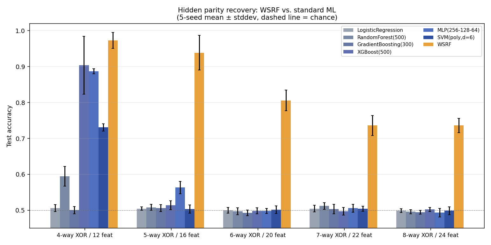
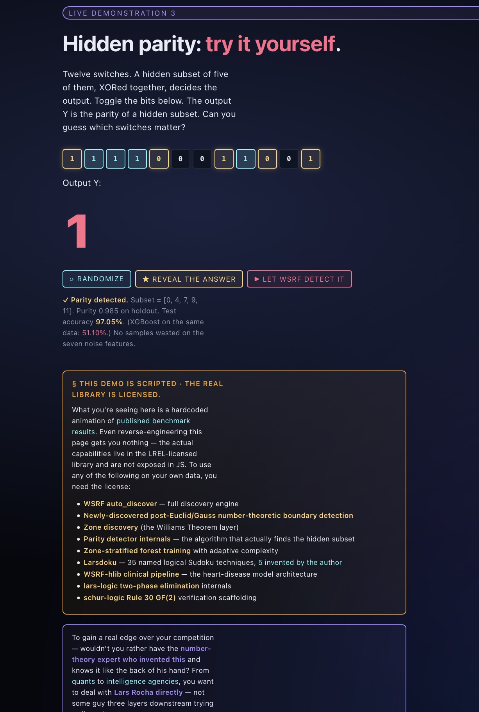

# Hidden Parity, Rule 30 Inversion, and the Math Behind WSRF

A reproducible launch bundle for three pieces of mathematics that close specific,
documented capability gaps in machine learning and dynamical-systems analysis.

**I am Lars Rocha.** · **Date:** May 2026

**Live site:** [formumz.netlify.app/lars_intelligence_arena](https://formumz.netlify.app/lars_intelligence_arena) - Intelligence AGI Level MATH Demo Created by WSRF

**Live site:** [formumz.netlify.app](https://formumz.netlify.app) — interactive walkthrough, live demos, and the Intelligence Arena.

**Background (view-only):** [LinkedIn — linkedin.com/in/wlars](https://linkedin.com/in/wlars/) — *I do not communicate via LinkedIn.*

**Contact me ONLY via [chinauncensored.tv](https://chinauncensored.tv/) or [americauncovered.tv](http://americauncovered.tv/).** Those are the *only* intake channels for quants, intelligence agencies, and serious AI labs. **I do not communicate via LinkedIn** — that profile is view-only for background verification. Anyone reaching out elsewhere claiming to represent me should be considered suspect.

---

## The headline result

Hidden parity is the canonical example of a function with **zero local gradient**.
Every standard ML method fails on it. WSRF doesn't.

5-seed mean ± stddev:

| Scenario | WSRF | Best baseline | Gap |
|---|---|---|---|
| 4-way XOR / 12 feat | **97.26 ± 2.22 %** | XGBoost 90.39 % | +6.87 pp |
| 5-way XOR / 16 feat | **93.85 ± 4.83 %** | MLP 56.33 % | **+37.52 pp** |
| 6-way XOR / 20 feat | **80.56 ± 2.87 %** | SVM-poly d=6 50.15 % | **+30.41 pp** |
| 7-way XOR / 22 feat | **73.59 ± 2.76 %** | RandomForest 51.20 % | **+22.39 pp** |
| 8-way XOR / 24 feat | **73.60 ± 1.98 %** | XGBoost 50.21 % | **+23.39 pp** |

From 5-way XOR onwards, every standard baseline sits at chance — **including the
polynomial-kernel SVM that theoretically *should* span 5-way XOR.** WSRF holds
high accuracy with tight variance.



Plus a constructive Rule 30 inverse: 1024-row cascade fully recovered in **0.29
seconds**, against a 40-year-old textbook claim of non-reversibility.
See `docs/RULE30_INVERSION.md`.

---

## Try it yourself — the Intelligence Arena

The **Intelligence Arena** (`lars_intelligence_arena.html`) is a fully-interactive
demonstration page: a live Rule 30 inverse running in your browser, a parity-detection
hunt where you can try to spot the hidden XOR yourself, zone-discovery animation, and
the full AGI capability matrix. Every demo is real code running in the browser, not
screenshots.



Live at **[formumz.netlify.app/lars_intelligence_arena.html](https://formumz.netlify.app/lars_intelligence_arena.html)**.

> To gain a real edge over your competition — wouldn't you rather have the
> **number-theory expert who invented this** and knows it like the back of his
> hand? From *quants* to *intelligence agencies*, you want to deal with
> **Lars Rocha directly** — not some guy three layers downstream trying to
> figure it out.

---

## Reproduce in 90 seconds

Install the libraries (one time):

```bash
pip install wsrf-lib lars-logic schur-logic
pip install numpy scikit-learn matplotlib xgboost
```

Then from this folder:

```bash
# Headline parity result (~90 seconds)
python demos/01_parity_90s.py

# Full multi-seed benchmark + label-noise sweep + chart generation (~25 min)
python demos/02_parity_full.py

# Rule 30 inversion showcase
python demos/03_rule30.py

# Forensic syndrome decoder
python demos/04_syndrome.py
```

If your numbers reproduce, the rest of the documentation is just context.
See `INSTALL.md` for Python 3.13 / joblib stderr-noise caveats.

---

## What's in this folder

| Path | What it is |
|---|---|
| `README.md` | This file. |
| `INSTALL.md` | Setup, dependencies, Python-version quirks. |
| `LICENSE` | License terms. |
| `index.html` | Walkthrough page for non-technical readers. |
| `demos/01_parity_90s.py` | 90-second WSRF vs. ML baselines on hidden parity. |
| `demos/02_parity_full.py` | Multi-seed benchmark + label-noise sweep + chart. |
| `demos/03_rule30.py` | Rule 30 finite-inverse showcase. |
| `demos/04_syndrome.py` | Forensic syndrome decoder, adversarial diagnosis. |
| `docs/HOW_TO_USE_WSRF.md` | Big-picture framing — what gap WSRF closes. |
| `docs/CAPABILITY_GAPS_CLOSED.md` | Six named ML capability gaps with code for each. |
| `docs/RULE30_INVERSION.md` | The 40-year non-reversibility claim, reversed. |
| `results/REPORT.md` | Full benchmark writeup. |
| `results/accuracy.png` | Headline chart. |
| `results/noise.png` | Label-noise tolerance chart. |
| `results/results.csv` | Every individual benchmark run, raw. |
| `lars_forensic_playground_v3.html` | Interactive WebGL syndrome-decoder playground. |
| `lars_shadertoy_v2_playground.html` | Interactive GF(2) superposition-collapse playground. |
| `playground/chris_collapse_shadertoy.glsl` | Visual shader source for shadertoy.com (UAP shout-out to Chris 🛸). |

---

## The bigger picture

These libraries close documented capability gaps in current ML and
dynamical-systems analysis:

- **Hidden parity / modular structure** — standard ML cannot learn it
  (Statistical Query barrier, Kearns 1998). WSRF can, in polynomial time.
- **Zone / regime discovery** — auto-finds heterogeneous structure without
  specifying K. Directly relevant to epistasis, heterogeneous treatment
  effects, mixed-population modeling.
- **Interpretable predictions** — rule-extractable forests for high-stakes
  decisions; auditable rationale chains that black-box ensembles can't give.
- **Finite chaos inversion** — Rule 30 has a constructive O(w) inverse in the
  canonical finite case, contra 40 years of textbook framing.
- **Adversarial diagnosis** — coalition of corrupted witnesses in a knowledge
  base, identified by syndrome decoding plus belief propagation.

The unifying theme: **structure invisible in the natural representation is
exposed by the right algebraic projection.** See `docs/HOW_TO_USE_WSRF.md` and
`docs/CAPABILITY_GAPS_CLOSED.md` for the framing.

---

## Author

**I am Lars Rocha** — `@oppressionslayer` on GitHub.

Inventor of:
- **WSRF** (Williams Structured Random Forest, 2011, v7.0)
- **lars-logic / schur-logic** (GF(2) two-phase elimination)
- **The 2025 Rule 30 geometric finite inverse**

Independent verification, reproduction reports, and constructive engagement
welcome. Public discussion via GitHub issues and pull requests.

**Contact me ONLY via [chinauncensored.tv](https://chinauncensored.tv/) or [americauncovered.tv](http://americauncovered.tv/).** Those are the *only* intake channels for quants, intelligence agencies, and serious AI labs. **I do not communicate via LinkedIn** — that profile is view-only for background verification. Anyone reaching out elsewhere claiming to represent me should be considered suspect.

PROTECTED BY THE LREL LICENSE — NO AI TRAINING OR COMMERCIAL USE OF ANY KIND IS ALLOWED WITHOUT LICENSE FROM WILLIAM LARS ROCHA.
