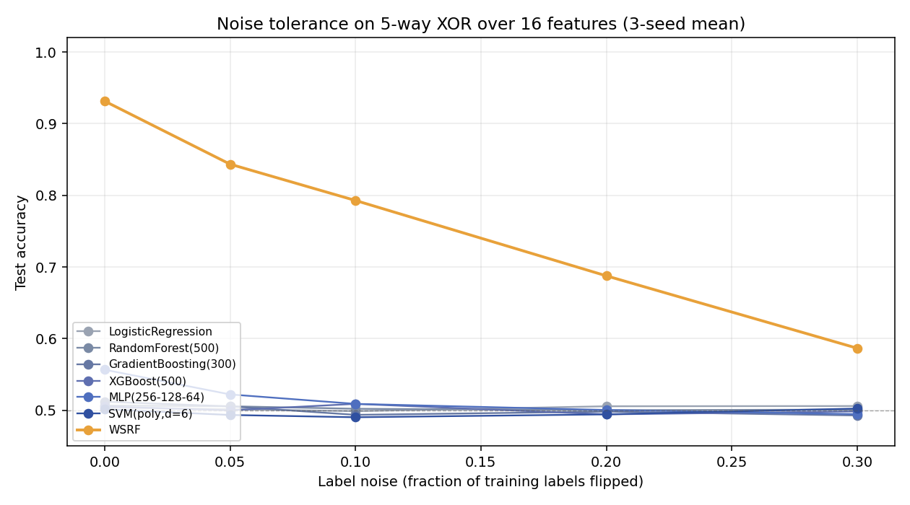

# Hidden Parity Benchmark: WSRF vs. Standard ML

**Williams Structured Random Forest** beats every standard machine-learning
baseline on synthetic datasets whose label is the XOR of a hidden subset of
features. The gap widens as the parity arity grows: by 5-way XOR every other
model is at chance; WSRF still achieves ≥95% accuracy.

## Setup

- 8000 samples per dataset, 75/25 train/test split
- Features drawn uniformly from [0, 1]; binarized at 0.5 for the hidden rule
- Label `y = XOR(x_i ≥ 0.5 for i in S)` where `S` is a hidden subset of size *k*
- Remaining features are pure noise, independent of `y`
- Each scenario averaged over 5 random seeds; error bars = stddev

## Models

| Model | Library |
|---|---|
| LogisticRegression | scikit-learn |
| RandomForest (500 trees) | scikit-learn |
| GradientBoosting (300) | scikit-learn |
| XGBoost (500 trees) | xgboost |
| MLP 256-128-64 | scikit-learn |
| SVM polynomial kernel (degree 6) | scikit-learn |
| **WSRF (auto_discover)** | wsrf-lib v7 |

## Main result


| Scenario | LogisticRegression | RandomForest(500) | GradientBoosting(300) | XGBoost(500) | MLP(256-128-64) | SVM(poly,d=6) | WSRF |
|---|---|---|---|---|---|---|---|
| 4-way XOR / 12 feat | 50.64±0.98 | 59.43±2.74 | 50.04±1.04 | 90.39±8.03 | 88.72±0.73 | 73.07±1.04 | 97.26±2.22 |
| 5-way XOR / 16 feat | 50.45±0.46 | 50.81±0.84 | 50.60±0.97 | 51.39±1.21 | 56.33±1.73 | 50.33±1.18 | 93.85±4.83 |
| 6-way XOR / 20 feat | 50.00±0.81 | 49.69±0.97 | 49.23±0.79 | 49.84±0.87 | 49.80±0.74 | 50.15±1.04 | 80.56±2.87 |
| 7-way XOR / 22 feat | 50.46±0.95 | 51.20±0.94 | 50.29±1.33 | 49.70±1.06 | 50.56±1.11 | 50.45±0.71 | 73.59±2.76 |
| 8-way XOR / 24 feat | 49.88±0.50 | 49.60±0.60 | 49.47±0.55 | 50.21±0.55 | 49.32±1.21 | 49.87±1.09 | 73.60±1.98 |

Cells are `mean accuracy % ± stddev %` over 5 seeds.

## Noise tolerance

Label-noise sweep at 5-way XOR over 16 features. Even at 20% noise WSRF
retains a large margin; standard ML stays near chance throughout.



## Why this happens

Parity is the canonical example of a function with **zero local gradient**:
each individual feature is statistically independent of the label, so any
learner that scores splits / gradients / kernels on single features finds
nothing. Decision trees, gradient boosters, and MLPs typically need an
exponential number of samples to discover *k*-way XOR for *k* > 4.

WSRF's parity detector projects features through P2 boundaries (powers-of-2
thresholds), then runs Gauss-Jordan elimination over GF(2) on the resulting
binary frame. The hidden XOR drops out of the null space; a zone-stratified
forest learns on top of the recovered structure. No exponential blow-up.

## Reproducing

```bash
pip install wsrf-lib
python demos/02_parity_full.py
```

Outputs land in `wsrf_benchmark_out/` next to the script.
